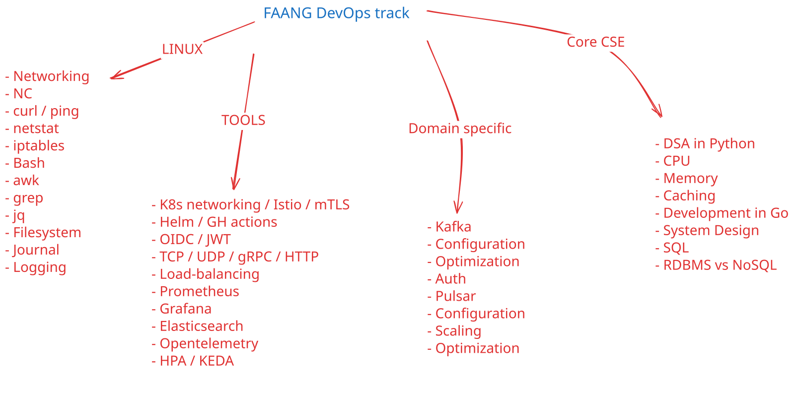

# FAANG DevOps preparation strategy

## 

## Resource list : -
### Linux 
- [Arch networking documentation](https://wiki.archlinux.org/title/Network_configuration)
- [NC command](https://phoenixnap.com/kb/nc-command)
- [curl command](https://curl.se/docs/tutorial.html)
- [netstat command](https://phoenixnap.com/kb/netstat-command)
- [Bash basic cheatsheet](https://devhints.io/bash)
- [awk](https://quickref.me/awk)
- [jq](https://cht.sh/jq)
- [Arch filesystem documentation](https://wiki.archlinux.org/title/File_systems)
- [Directory structure](https://www.linuxfoundation.org/blog/blog/classic-sysadmin-the-linux-filesystem-explained)
- [systemd](https://wiki.archlinux.org/title/Systemd)
- [journalctl](https://wiki.archlinux.org/title/Systemd/Journal)
- [Linux logs](https://sematext.com/blog/linux-logs/)

### Tools
- [Kubernetes networking basics](https://sookocheff.com/post/kubernetes/understanding-kubernetes-networking-model/)
- [Kubernetes networking deep-dive](https://notes.kodekloud.com/docs/Kubernetes-Networking-Deep-Dive/Kubernetes-Networking/Course-Introduction)
- [Istio documentation](https://istio.io/latest/docs/)
- [mTLS](https://beeceptor.com/docs/concepts/mtls/)
- [Helm cheat-sheet](https://helm.sh/docs/intro/cheatsheet/)
- [GitHub actions and workflows](https://docs.github.com/en/actions/reference/workflows-and-actions/workflow-syntax)
- [OIDC implementation](https://infosec.mozilla.org/guidelines/iam/openid_connect.html)
- [JWT basics](https://auth0.com/docs/secure/tokens/json-web-tokens)
- [HTTP deep dive](https://beeceptor.com/docs/concepts/types-of-http-headers/)
- [gRPC basics](https://grpc.io/docs/languages/go/basics/)
- [gRPC deep dive](https://grpc.io/docs/guides/)
- [Load-balancing deep dive](https://nginx.org/en/docs/http/load_balancing.html)
- [Prometheus architecture](https://prometheus.io/docs/introduction/overview/)
- [Grafana architecture](https://www.kozhuhds.com/blog/an-easy-look-at-grafana-architecture/)
- [ElasticSearch architecture](https://www.elastic.co/docs/deploy-manage/distributed-architecture)
- [Opentelemetry architecture](https://opentelemetry.io/docs/collector/architecture/)
- [HPA guide](https://kubernetes.io/docs/tasks/run-application/horizontal-pod-autoscale/)
- [KEDA deep dive](https://keda.sh/docs/2.14/concepts/)

### Event stream domain specific
- [Kafka redpanda docs : you MUST read every doc in the index](https://www.redpanda.com/guides/kafka-architecture)
- [Pulsar vs Kafka](https://dzone.com/articles/a-deep-dive-into-the-differences-between-kafka-and)
- [Pulsar deep dive -- read though ALL the docs in nested index](https://pulsar.apache.org/docs/3.1.x/concepts-overview/)

### Core CS fundamentals
- DSA in python
    - [Before you begin the grind](https://blog.algomaster.io/p/15-leetcode-patterns)
    - [The ACTUAL grind - complete the whole roadmap](https://neetcode.io/roadmap)
- [Actual architecture and the processor](../books/Microprocessors.pdf)
- [CPU & Memory deep dive -- optional](../books/cpumemory.pdf)
- For GO development : just build multi-threaded go apps using channels
- [System Design primer](https://systemdesignschool.io/primer#cache)
- [System design core concepts](https://www.hellointerview.com/learn/system-design/core-concepts/networking-essentials)
- [Redis deep dive](https://www.hellointerview.com/learn/system-design/deep-dives/redis)
- [System Design deep dive -- this is a never-ending pursuit](https://www.designgurus.io/courses)
- [SQL cheat-sheet](https://www.datacamp.com/cheat-sheet/postgre-sql-basics-cheat-sheet)

### Cloud & Terraform
- [AWS design framework](https://docs.aws.amazon.com/wellarchitected/latest/framework/welcome.html)
- [Terraform architecture](https://spacelift.io/blog/terraform-architecture)