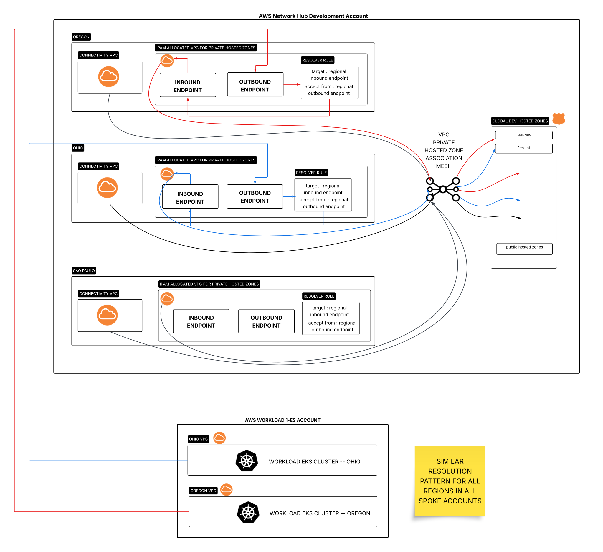

# Cross-region Multi-account AWS DNS Mesh

## What do you mean by DNS mesh ? and why should we bother with it ?

- DNS mesh is a term I coined, its not part of any popular literature as far as I know
- DNS mesh enables centralized DNS resolution and management in any distributed system (multi-account or multi-region or both)
- This article is heavily focused on AWS and how to implement the "mesh" in AWS using route53 services
- The mesh enables centralized auditing and security controls pertaining to DNS
- The mesh enables easier and centralized IAC for all DNS components in an architecture
- The mesh would further allow for centralized flow-logs and DNS resolver queries
- The mesh can receive and respond to resolution requests from any AWS account and region to private hosted zones tied to any AWS VPC in any region within the centralised AWS account

## Constraints and requirements

- Should be a single point of DNS management across the firm
- Should have centralized flow-logs and DNS resolution query logs
- Should have centralized DDOS protection and security audit controls
- Should be able to handle 10K QPS per resolver endpoint per region
- Services running in any consumer AWS account must have the ability to create records in the centralized account
- Should be hosted using Terraform ... NO manual components at all
- Should have alerting and monitoring systems baked in to prevent unwarranted failures
- Should have 2 degress of redundancy (AZ level and region level)

## The solution

## Lets talk implementation

The idea is quite simple and relies on the underlying AWS magic that allows you to manage private hosted zones without setting up explicit DNS delegations.

### _route53 delegation magic_

When you create a private hosted zone, the following name servers are used: -

- ns-0.awsdns-00.com
- ns-512.awsdns-00.net
- ns-1024.awsdns-00.org
- ns-1536.awsdns-00.co.uk

These name servers are used because the DNS protocol requires that every hosted zone must have an NS record set. These name servers are reserved and never used by Route 53 public hosted zones. You can only query those zones via Route 53 Resolver in a VPC that has been associated to the hosted zone by using an inbound endpoint connected to the VPCs specified in the private hosted zone

Because all the private hosted zones have the same set of nameservers, setting up delegation would be pointless, you'd be delegating to the same set of servers across all zones. On top of this, your current zone already has these entries running as active servers, effectively, delegation is already set-up whenever you create a new private zone.

### _how to setup i/o between different private hosted zones_

